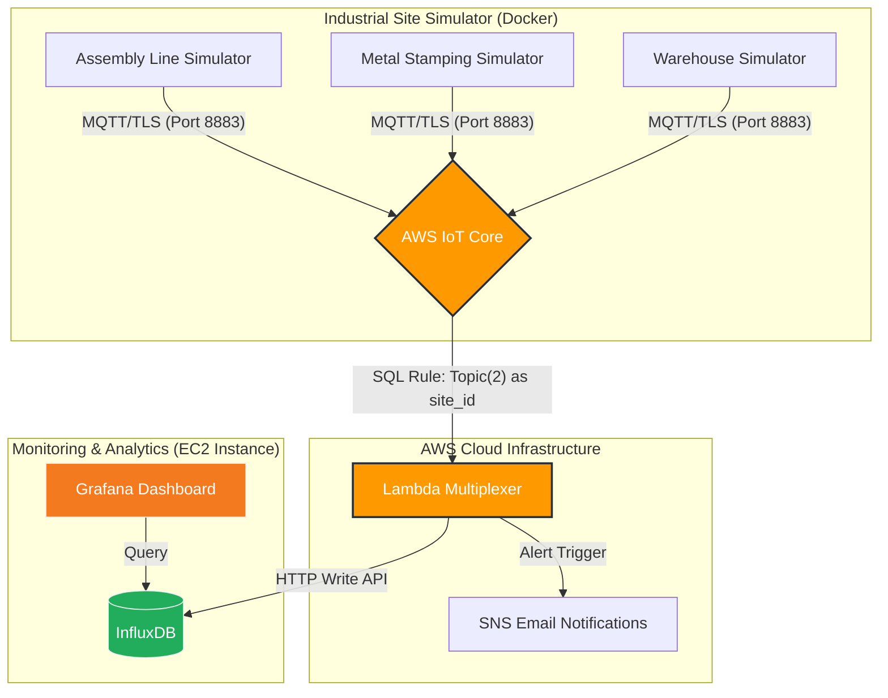

# AWS-IoTCore-Industrial-Hub 🏭☁️

This project demonstrates the use of **AWS IoT Core** as a central message hub to ingest, process, and visualize telemetry from multiple industrial sites.

## Overview

The platform models a real-world industrial scenario where different factories (Assembly Lines, Warehouses, etc.) send sensor data to the cloud. The system handles real-time data ingestion, automated alerting based on configurable thresholds, and long-term storage for visualization.

### Key Workflows:

1. **Ingestion**: Devices (Dockerized Simulators) send MQTT data to AWS IoT Core via TLS 1.2.
2. **Processing**: A **Lambda Multiplexer** intercepts messages, identifies the origin site, and evaluates metrics.
3. **Alerting**: If a metric exceeds a threshold, an **SNS (Simple Notification Service)** alert is triggered (Email).
4. **Storage & Visualization**: Data is persisted into an **InfluxDB** time-series database and visualized through **Grafana** (both running in Docker on an **AWS EC2** instance).

---

### 📊 System Architecture & Data Flow

The following diagram illustrates the end-to-end data pipeline, highlighting the event-driven architecture from MQTT message ingestion to real-time visualization and alerting."



---

## 🛠 Tech Stack

* **Cloud Infrastructure**: AWS (IoT Core, Lambda, SNS, IAM, EC2)
* **Infrastructure as Code**: Terraform
* **Containerization**: Docker & Docker Compose
* **Time-Series Database**: InfluxDB
* **Visualization**: Grafana
* **Programming**: Python (Lambda/Simulators), HCL (Terraform)

---

## 📂 Project Structure

The project is divided into two main repositories/folders to decouple infrastructure management from device simulation:

### 1. `iot-factories-infrastructure/`

Contains the **Infrastructure as Code (IaC)** to deploy the AWS cloud stack.

* **`main.tf`**: Root configuration. Orchestrates the Lambda function, SNS alerts, and IoT Topic Rules.
* **`variables.tf`**: Global variables (AWS Region, Factory maps).
* **`modules/factory_site/`**:
* `main.tf`: Creates AWS IoT Things, X.509 Certificates, and IoT Policies.
* `outputs.tf`: Exports ARNs and certificate details.
* `variables.tf`: Define input variables for the module. 


* **`package/`**: The deployment package for the backend logic.
* `lambda_function.py`: Python multiplexer that processes MQTT data and writes to InfluxDB.
* `thresholds.json`: Dynamic alerting configuration.
* `requirements.txt`: List of Python dependencies (e.g., `influxdb-client`).
* `lib/`: (Ignored by Git) Local folder containing installed dependencies. This folder must be populated via pip install -t package/lib -r package/requirements.txt before deployment to ensure the Lambda runtime finds the influxdb-client

### 2. `iot-factories-simulator/`

Contains the **Dockerized environment** to simulate industrial hardware.

* **`main.py`**: Multi-client MQTT simulator that reads device lists from environment variables.
* **`docker-compose.yaml`**: Orchestrates the simulator containers.
* **`.env`**: (Ignored by Git) Configuration for AWS Endpoint, Factory ID, and Device lists.
* **`certs/`**: (Ignored by Git) This folder must contain the certificates generated by the Terraform module to allow secure TLS communication.

---

## 🔒 Security & Connectivity
This platform prioritizes industrial-grade security:
- **X.509 Authentication**: Every simulated device uses a unique certificate generated by Terraform.
- **Topic Isolation**: IoT Policies prevent a device in `Factory-A` from publishing or subscribing to topics belonging to `Factory-B`.
- **mTLS Encryption**: Full encryption in transit via MQTT over Port 8883.

---

## 🔧 Installation & Usage

### Step 1: Infrastructure Deployment

Navigate to the infrastructure folder and apply the Terraform plan:

```bash
cd iot-factories-infrastructure
terraform init
terraform apply

```

*Note: This will generate a `certs/` folder at the root of the infrastructure directory.*

### Step 2: Simulator Setup

1. Copy the generated certificates from `infrastructure/certs/` to `simulator/certs/`.
2. Configure your `.env` file in the simulator folder.
3. Start the simulation:

```bash
cd iot-factories-simulator
docker-compose up -d

```

---

